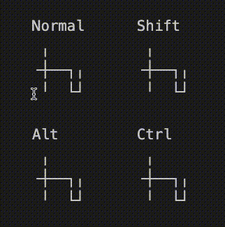

# Unicode Box Art Draw

    

This extension lets you draw with Unicode's box art characters directly in VSCode!

> Based on [MarkLodato/js-boxdrawing](https://github.com/MarkLodato/js-boxdrawing)

> Also see [Overtype by DrMerfy](vscode:extension/drmerfy.overtype)

## Usage

All keybinds, excluding the toggle command, are active only while drawing mode is enabled.

**NOTE:** Padding is currently UNIMPLEMENTED, and the cursor will not draw nicely over empty space. You must pad the empty space you intend to draw over with spaces beforehand.

### Commands
> I highly recommend you remap these to your liking!

- `Ctrl+Shift+Insert` - Toggle between drawing and regular typing
- **Line Styles**:
  - `N` - Set to *Normal* line style
  - `B` - Set to *Bold* line style
  - `K` - Set to *Double* line style
  - `Delete` - Erase lines
- **Drawing**:
  - Arrow Keys - Draw a line in the chosen style
  - `Shift`+Arrow Keys - Draw a line segment in-place
  - `Alt`+Arrow Keys - Paint over lines (replacing instead of creating)
  - `Shift+Alt`+Arrow Keys - Paint over line segments in-place (replacing instead of creating)
- **Transformations**:
  - `[` - Rotate left
  - `]` - Rotate right
  - `Shift+[` - Flip horizontally
  - `Shift+]` - Flip vertically
- **Batch-painting**:
  - See below for difference
  - `P` - Paint a line (no turning, no splitting)
  - `Shift+P` - Paint a curve (no splitting)
  - `Alt+P` - Paint a branch (no turning)
  - `Ctrl+P` - Paint a shape
  - You can use these with the eraser to delete instead

## Gallery

Comparison of batch-painting modes

Building a table

## Installation

1. Open the Extensions view in VS Code (`Ctrl+Shift+X`)
2. Search for **"Unicode Box Art Drawing"** and install it
3. Start drawing by toggling drawing mode with `Ctrl+Shift+Insert`!

## Source Code
You can view and contribute to the source code at the [GitHub Repo](https://github.com/aadenboy/vscode-unicode-box-art)
